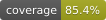

Для запуска необходимо инициализировать переменные среды (см. для примера .env.example) следующим образом
|Переменная среды|Описание|
|:---|:------|
|POSTGRES_USER|Имя пользователя PostgreSQL|
|POSTGRES_PASSWORD|Пароль пользователя PostgreSQL|
|PUBLIC_URL|URL сервера, на котором запускается приложение|
|CLIENT_ID|client id приложения на GitHub|
|CLIENT_SECRET|client secret приложения на GitHub|
|AZURE_CLIENT_ID|client id приложения на Azure|
|AZURE_CLIENT_SECRET|client secret приложения на Azure|
|AZURE_TENANT_ID|tenant id приложения на Azure|
|AZURE_ISSUER_URL|issuer url приложения на Azure|

## История действий и срок её хранения

Каждое изменение состава — команды, участники, заявки, ссылки-приглашения, анкеты, роли, настройки
набора и передача в кабинет ПД — пишется в таблицу `activity_log` и читается администратором через
`GET /api/v1/admin/activity` (фильтры: команда, студент, автор, период).

Записи называют студентов по имени, поэтому не живут вечно. Срок хранения задаёт
`app.activity.retention-days` (по умолчанию 400 — набор плюс год). Чистка не фоновая: она идёт,
когда администратор начинает новый набор, и по запросу `POST /api/v1/admin/activity/purge`.

## Профиль `smoke` — сквозной смоук без СФЕДУ SSO

Профиль для скриптового прогона пути студента (Playwright-смоук во фронт-форке, `npm run smoke`). **Никогда не включается в prod:** старт с `prod` и `smoke` одновременно падает (`SmokeProfileGuard`).

Под профилем:

- `POST /api/v1/smoke/login` с телом `{"email": "..."}` входит под этой почтой так же, как вход через SSO: те же правила первого входа, та же сессия, тот же ответ о стартовой странице (`redirect`). Запрос проверяется на CSRF, как любой POST: сначала получить cookie `XSRF-TOKEN`, затем отправить его в заголовке `X-XSRF-TOKEN`. Без профиля эндпоинта нет.
- Azure не нужен: приложение стартует без сети и без `AZURE_*`.
- После миграций накатывается сид `db/smoke/afterMigrate.sql`: активный «Смоук-набор» с окном, открытым сегодня, и местами 3 + 3; `admin@smoke.test` (админ), `lead@smoke.test` (2 курс, без команды), `first@smoke.test` (1 курс), `second@smoke.test` (2 курс). Сид можно накатывать повторно, окно каждый раз сдвигается на сегодня.

Обычно профиль поднимает `docker-compose.smoke.yml` фронт-форка. Вручную:

```bash
SPRING_PROFILES_ACTIVE=smoke SPRING_DATASOURCE_URL=jdbc:postgresql://localhost:5432/team-selection mvn spring-boot:run
```
